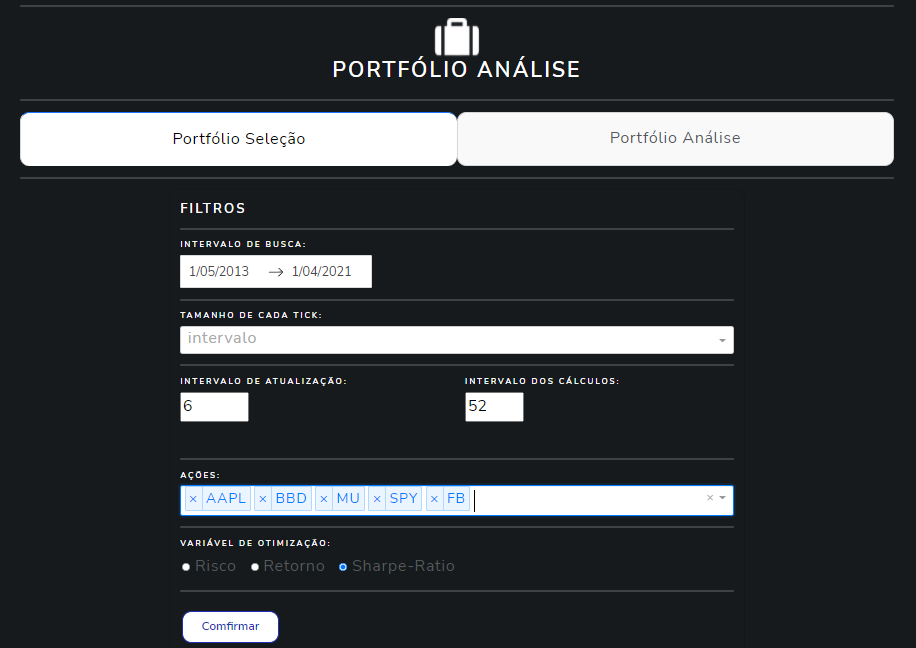
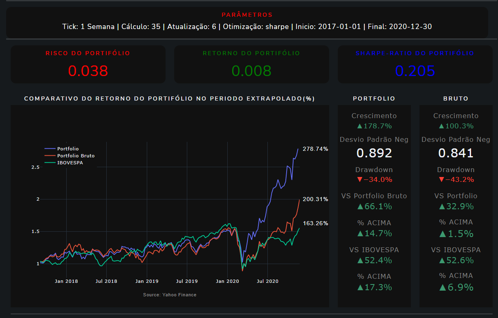
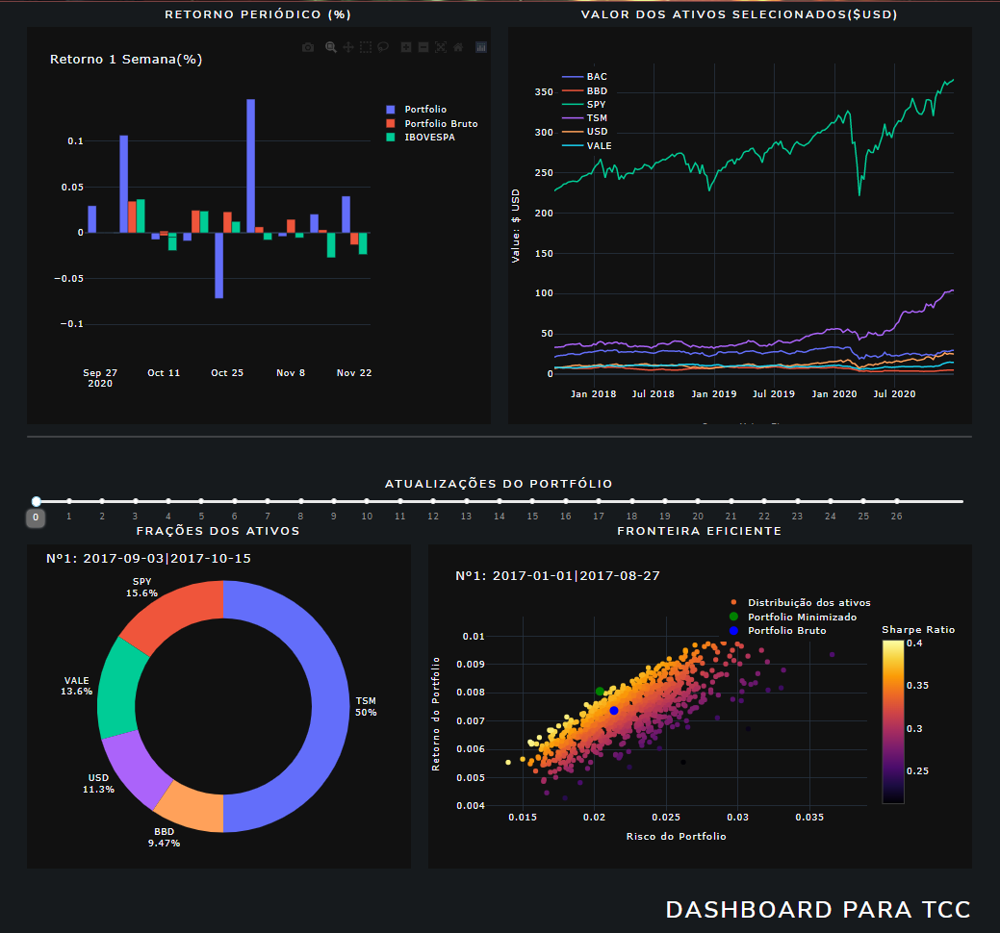
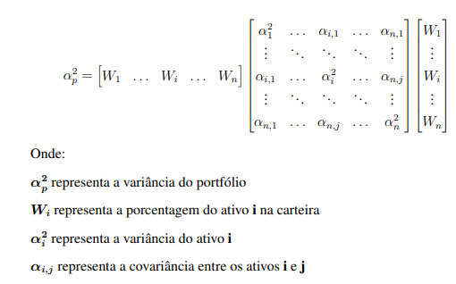
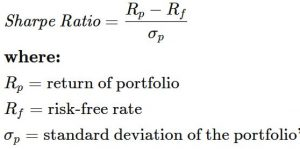

# Gerenciador de Portfóli por otimização de Risco e Sharpe
## Sistema desenvolvido para realizar simulações para o meu TCC: Concluido :heavy_check_mark:

> Aba Configuração

> Aba Resultados

> Status do Teste: Concluido :heavy_check_mark:

## Linguagens e libs :books:

- Python: versão 3.9
- Dash
- Scipy
- Yahoo Finance

## Configurações:
- Seleção de periodo de simulação
- Tempo do Tick utilizado
- Frequência de atualização dos pesos portfólio
- Quanditade de Tick utilizados nos cálculos
- Seleção dos ativos
- Seleção de função objetivo para a otimização

## Otimizações:
- Risco de Markowitz

- Indice Sharpe

